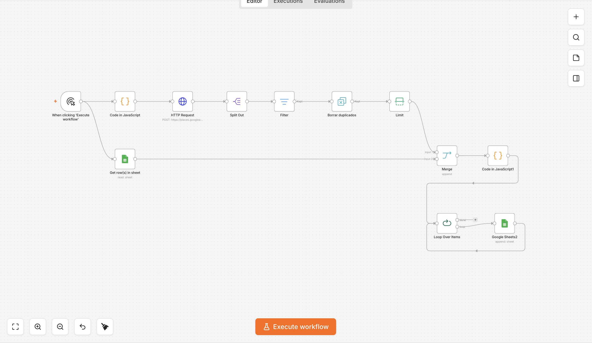
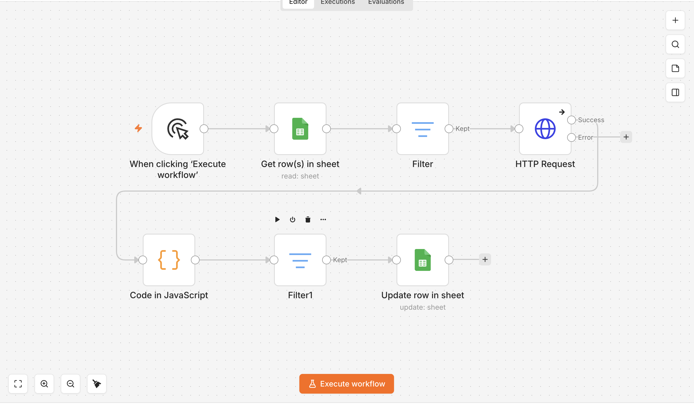
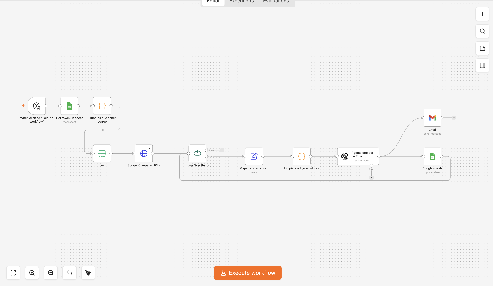

# Automated B2B Lead Generation & AI Outreach Pipeline

An end-to-end, multi-stage orchestration pipeline built in n8n. This system autonomously discovers local businesses via APIs, enriches the dataset by scraping contact information, and generates hyper-personalized outreach campaigns using Large Language Models (LLMs).

## 🚀 Architecture & Workflow

The architecture is divided into three decoupled micro-workflows to ensure scalability and fault tolerance:

### 1. Data Acquisition Engine (Lead Scraper)
- **API Integration:** Direct HTTP requests to the Google Places API to dynamically search for specific business niches across multiple geographic coordinates.
- **Data Processing:** Implements custom JavaScript nodes to parse API payloads, filter by strict place types (e.g., `nail_salon`, `beauty_salon`), and execute complex deduplication logic against existing database entries.
- **State Management:** Automatically appends clean, validated records (Name, Phone, Website, Address) into a centralized Google Sheets database.

### 2. Enrichment Pipeline (Email Extractor)
- **Automated Web Scraping:** Iterates through the stored business URLs, bypassing basic bot protections with strategic delays.
- **Regex & HTML Parsing:** Scans the raw HTML of local business websites to extract valid email addresses.
- **Data Normalization:** Deduplicates the extracted emails and updates the core database in real-time.

### 3. Agentic Outreach (AI Icebreaker)
- **Contextual Generation:** Feeds the enriched business data into an LLM (Claude/OpenAI).
- **Prompt Engineering:** Generates highly personalized, context-aware introductory emails tailored to the specific business niche and location.
- **Automated Dispatch:** Integrates with email service providers to automatically queue and send the AI-generated outreach campaigns.

## 🛠️ Tech Stack & Skills Demonstrated
- **Workflow Orchestration:** n8n (Advanced looping, batching, and error handling)
- **Custom Logic:** JavaScript (ES6) for data manipulation and array filtering
- **APIs & Integrations:** REST APIs, Google Places API, Google Sheets API, LLM APIs
- **Data Engineering:** ETL processes, web scraping, data normalization, and deduplication

## 📸 Pipeline Visualizations

*(Screenshots of the modular workflows)*

